# Database Design - ER Schema Diagram

## Overview
This document provides a complete Entity-Relationship (ER) diagram of the EduPredict database schema, showing all tables, their fields, data types, and relationships.

---

## ER Diagram (Mermaid.js)

```mermaid
erDiagram
    USERS {
        int id PK "AUTO_INCREMENT"
        varchar name "NOT NULL"
        varchar email "UNIQUE, NOT NULL"
        varchar password "NOT NULL"
        enum role "admin|instructor|student, NOT NULL"
        enum status "active|inactive, DEFAULT active"
        timestamp created_at "DEFAULT CURRENT_TIMESTAMP"
    }
    
    STUDENTS {
        int id PK "AUTO_INCREMENT"
        int user_id FK "REFERENCES users(id)"
        varchar student_id "UNIQUE, NOT NULL"
        decimal gpa "3,2, DEFAULT 0.00"
        decimal attendance_rate "5,2, DEFAULT 0.00"
        enum risk_level "low|medium|high, DEFAULT low"
        timestamp created_at "DEFAULT CURRENT_TIMESTAMP"
    }
    
    COURSES {
        int id PK "AUTO_INCREMENT"
        varchar course_code "NOT NULL"
        varchar course_name "NOT NULL"
        int instructor_id FK "REFERENCES users(id)"
        int credits "DEFAULT 3"
        timestamp created_at "DEFAULT CURRENT_TIMESTAMP"
    }
    
    ENROLLMENTS {
        int id PK "AUTO_INCREMENT"
        int student_id FK "REFERENCES students(id)"
        int course_id FK "REFERENCES courses(id)"
        timestamp enrollment_date "DEFAULT CURRENT_TIMESTAMP"
        enum status "active|completed|dropped, DEFAULT active"
    }
    
    GRADES {
        int id PK "AUTO_INCREMENT"
        int student_id FK "REFERENCES students(id)"
        int course_id FK "REFERENCES courses(id)"
        enum assignment_type "quiz|exam|assignment|project, NOT NULL"
        decimal grade "5,2, NOT NULL"
        decimal max_grade "5,2, DEFAULT 100.00"
        timestamp date_recorded "DEFAULT CURRENT_TIMESTAMP"
    }
    
    PREDICTIONS {
        int id PK "AUTO_INCREMENT"
        int student_id FK "REFERENCES students(id)"
        int course_id FK "REFERENCES courses(id), NULLABLE"
        decimal predicted_grade "5,2, NULLABLE"
        decimal confidence_score "5,2, NULLABLE"
        text risk_factors "JSON format"
        timestamp prediction_date "DEFAULT CURRENT_TIMESTAMP"
    }
    
    ALERTS {
        int id PK "AUTO_INCREMENT"
        int student_id FK "REFERENCES students(id)"
        enum alert_type "at_risk|low_performance|attendance|grade_drop, NOT NULL"
        text message "NOT NULL"
        enum severity "low|medium|high, DEFAULT medium"
        enum status "active|resolved|dismissed, DEFAULT active"
        timestamp created_at "DEFAULT CURRENT_TIMESTAMP"
    }
    
    FEEDBACK {
        int id PK "AUTO_INCREMENT"
        int user_id FK "REFERENCES users(id), NULLABLE"
        enum feedback_type "prediction_accuracy|system_usability|feature_request|bug_report, NOT NULL"
        varchar subject "200 chars"
        text message "NOT NULL"
        int rating "CHECK 1-5"
        enum status "new|reviewed|resolved, DEFAULT new"
        timestamp created_at "DEFAULT CURRENT_TIMESTAMP"
    }
    
    CONTACT_MESSAGES {
        int id PK "AUTO_INCREMENT"
        varchar name "100, NOT NULL"
        varchar email "100, NOT NULL"
        varchar subject "200"
        text message "NOT NULL"
        enum status "new|read|replied, DEFAULT new"
        timestamp created_at "DEFAULT CURRENT_TIMESTAMP"
    }
    
    MENU_ITEMS {
        int id PK "AUTO_INCREMENT"
        varchar title "100, NOT NULL"
        varchar url "255, NOT NULL"
        varchar icon "50"
        enum role "admin|instructor|student|public, DEFAULT public"
        int parent_id FK "REFERENCES menu_items(id), NULLABLE"
        int sort_order "DEFAULT 0"
        enum status "active|inactive, DEFAULT active"
        timestamp created_at "DEFAULT CURRENT_TIMESTAMP"
        timestamp updated_at "ON UPDATE CURRENT_TIMESTAMP"
    }
    
    %% Relationships
    USERS ||--o{ STUDENTS : "has"
    USERS ||--o{ COURSES : "teaches"
    USERS ||--o{ FEEDBACK : "submits"
    
    STUDENTS ||--o{ ENROLLMENTS : "enrolls_in"
    STUDENTS ||--o{ GRADES : "receives"
    STUDENTS ||--o{ PREDICTIONS : "has"
    STUDENTS ||--o{ ALERTS : "triggers"
    
    COURSES ||--o{ ENROLLMENTS : "has"
    COURSES ||--o{ GRADES : "contains"
    COURSES ||--o{ PREDICTIONS : "has"
    
    MENU_ITEMS ||--o{ MENU_ITEMS : "parent_child"
```



---

## Detailed Table Specifications

### 1. USERS Table
**Purpose:** Stores all system users (admins, instructors, students)

| Field | Type | Constraints | Description |
|-------|------|-------------|-------------|
| `id` | INT | PRIMARY KEY, AUTO_INCREMENT | Unique user identifier |
| `name` | VARCHAR(100) | NOT NULL | User's full name |
| `email` | VARCHAR(100) | UNIQUE, NOT NULL | User's email address (login) |
| `password` | VARCHAR(255) | NOT NULL | Hashed password |
| `role` | ENUM | NOT NULL | User role: 'admin', 'instructor', 'student' |
| `status` | ENUM | DEFAULT 'active' | Account status: 'active', 'inactive' |
| `created_at` | TIMESTAMP | DEFAULT CURRENT_TIMESTAMP | Account creation date |

**Indexes:**
- PRIMARY KEY: `id`
- UNIQUE: `email`

---

### 2. STUDENTS Table
**Purpose:** Stores student-specific academic data

| Field | Type | Constraints | Description |
|-------|------|-------------|-------------|
| `id` | INT | PRIMARY KEY, AUTO_INCREMENT | Unique student identifier |
| `user_id` | INT | FOREIGN KEY → users(id), ON DELETE CASCADE | Links to users table |
| `student_id` | VARCHAR(20) | UNIQUE, NOT NULL | Student ID number |
| `gpa` | DECIMAL(3,2) | DEFAULT 0.00 | Current GPA (0.00-4.00) |
| `attendance_rate` | DECIMAL(5,2) | DEFAULT 0.00 | Attendance percentage (0.00-100.00) |
| `risk_level` | ENUM | DEFAULT 'low' | Risk assessment: 'low', 'medium', 'high' |
| `created_at` | TIMESTAMP | DEFAULT CURRENT_TIMESTAMP | Record creation date |

**Indexes:**
- PRIMARY KEY: `id`
- UNIQUE: `student_id`
- FOREIGN KEY: `user_id` → `users(id)`

**Relationships:**
- One-to-One with `users` (via `user_id`)
- One-to-Many with `enrollments`
- One-to-Many with `grades`
- One-to-Many with `predictions`
- One-to-Many with `alerts`

---

### 3. COURSES Table
**Purpose:** Stores course information

| Field | Type | Constraints | Description |
|-------|------|-------------|-------------|
| `id` | INT | PRIMARY KEY, AUTO_INCREMENT | Unique course identifier |
| `course_code` | VARCHAR(20) | NOT NULL | Course code (e.g., "CS101") |
| `course_name` | VARCHAR(100) | NOT NULL | Full course name |
| `instructor_id` | INT | FOREIGN KEY → users(id), ON DELETE SET NULL | Assigned instructor |
| `credits` | INT | DEFAULT 3 | Credit hours |
| `created_at` | TIMESTAMP | DEFAULT CURRENT_TIMESTAMP | Course creation date |

**Indexes:**
- PRIMARY KEY: `id`
- FOREIGN KEY: `instructor_id` → `users(id)`

**Relationships:**
- Many-to-One with `users` (instructor)
- One-to-Many with `enrollments`
- One-to-Many with `grades`
- One-to-Many with `predictions`

---

### 4. ENROLLMENTS Table
**Purpose:** Junction table for student-course relationships

| Field | Type | Constraints | Description |
|-------|------|-------------|-------------|
| `id` | INT | PRIMARY KEY, AUTO_INCREMENT | Unique enrollment identifier |
| `student_id` | INT | FOREIGN KEY → students(id), ON DELETE CASCADE | Enrolled student |
| `course_id` | INT | FOREIGN KEY → courses(id), ON DELETE CASCADE | Course enrolled in |
| `enrollment_date` | TIMESTAMP | DEFAULT CURRENT_TIMESTAMP | Enrollment date |
| `status` | ENUM | DEFAULT 'active' | Status: 'active', 'completed', 'dropped' |

**Indexes:**
- PRIMARY KEY: `id`
- FOREIGN KEY: `student_id` → `students(id)`
- FOREIGN KEY: `course_id` → `courses(id)`

**Relationships:**
- Many-to-One with `students`
- Many-to-One with `courses`

**Business Rules:**
- A student can enroll in multiple courses
- A course can have multiple students
- Enrollment status tracks student progress

---

### 5. GRADES Table
**Purpose:** Stores individual assignment/exam grades

| Field | Type | Constraints | Description |
|-------|------|-------------|-------------|
| `id` | INT | PRIMARY KEY, AUTO_INCREMENT | Unique grade identifier |
| `student_id` | INT | FOREIGN KEY → students(id), ON DELETE CASCADE | Student who received grade |
| `course_id` | INT | FOREIGN KEY → courses(id), ON DELETE CASCADE | Course the grade belongs to |
| `assignment_type` | ENUM | NOT NULL | Type: 'quiz', 'exam', 'assignment', 'project' |
| `grade` | DECIMAL(5,2) | NOT NULL | Grade received |
| `max_grade` | DECIMAL(5,2) | DEFAULT 100.00 | Maximum possible grade |
| `date_recorded` | TIMESTAMP | DEFAULT CURRENT_TIMESTAMP | When grade was recorded |

**Indexes:**
- PRIMARY KEY: `id`
- FOREIGN KEY: `student_id` → `students(id)`
- FOREIGN KEY: `course_id` → `courses(id)`

**Relationships:**
- Many-to-One with `students`
- Many-to-One with `courses`

**Business Rules:**
- Multiple grades per student per course
- Grades trigger automatic prediction updates

---

### 6. PREDICTIONS Table
**Purpose:** Stores ML prediction results

| Field | Type | Constraints | Description |
|-------|------|-------------|-------------|
| `id` | INT | PRIMARY KEY, AUTO_INCREMENT | Unique prediction identifier |
| `student_id` | INT | FOREIGN KEY → students(id), ON DELETE CASCADE | Student being predicted |
| `course_id` | INT | FOREIGN KEY → courses(id), ON DELETE CASCADE, NULLABLE | Course-specific prediction (NULL = overall) |
| `predicted_grade` | DECIMAL(5,2) | NULLABLE | Predicted grade percentage |
| `confidence_score` | DECIMAL(5,2) | NULLABLE | ML confidence (0.00-1.00) |
| `risk_factors` | TEXT | JSON format | Risk factors and prediction data (JSON) |
| `prediction_date` | TIMESTAMP | DEFAULT CURRENT_TIMESTAMP | When prediction was generated |

**Indexes:**
- PRIMARY KEY: `id`
- FOREIGN KEY: `student_id` → `students(id)`
- FOREIGN KEY: `course_id` → `courses(id)`

**Relationships:**
- Many-to-One with `students`
- Many-to-One with `courses` (nullable for overall predictions)

**Business Rules:**
- One prediction per student per course (or overall if `course_id` is NULL)
- `risk_factors` JSON contains: `predicted_gpa`, `current_gpa`, `gpa_trend`, `gpa_change`
- Predictions are regenerated when new grades are added

**JSON Structure in `risk_factors`:**
```json
{
  "prediction_data": {
    "predicted_grade": 85.5,
    "predicted_gpa": 3.0,
    "current_gpa": 2.75,
    "gpa_trend": "increase",
    "gpa_change": 0.25
  },
  "risk_factors": [
    "Low attendance rate (65.0%)",
    "Few assignments completed (2 completed)"
  ]
}
```

---

### 7. ALERTS Table
**Purpose:** Stores risk alerts for students

| Field | Type | Constraints | Description |
|-------|------|-------------|-------------|
| `id` | INT | PRIMARY KEY, AUTO_INCREMENT | Unique alert identifier |
| `student_id` | INT | FOREIGN KEY → students(id), ON DELETE CASCADE | Student with alert |
| `alert_type` | ENUM | NOT NULL | Type: 'at_risk', 'low_performance', 'attendance', 'grade_drop' |
| `message` | TEXT | NOT NULL | Alert message |
| `severity` | ENUM | DEFAULT 'medium' | Severity: 'low', 'medium', 'high' |
| `status` | ENUM | DEFAULT 'active' | Status: 'active', 'resolved', 'dismissed' |
| `created_at` | TIMESTAMP | DEFAULT CURRENT_TIMESTAMP | Alert creation date |

**Indexes:**
- PRIMARY KEY: `id`
- FOREIGN KEY: `student_id` → `students(id)`

**Relationships:**
- Many-to-One with `students`

**Business Rules:**
- Alerts are auto-generated when risk level is 'high'
- Instructors can resolve or dismiss alerts

---

### 8. FEEDBACK Table
**Purpose:** Stores user feedback

| Field | Type | Constraints | Description |
|-------|------|-------------|-------------|
| `id` | INT | PRIMARY KEY, AUTO_INCREMENT | Unique feedback identifier |
| `user_id` | INT | FOREIGN KEY → users(id), ON DELETE SET NULL, NULLABLE | User who submitted feedback |
| `feedback_type` | ENUM | NOT NULL | Type: 'prediction_accuracy', 'system_usability', 'feature_request', 'bug_report' |
| `subject` | VARCHAR(200) | NULLABLE | Feedback subject |
| `message` | TEXT | NOT NULL | Feedback message |
| `rating` | INT | CHECK (1-5) | User rating (1-5 stars) |
| `status` | ENUM | DEFAULT 'new' | Status: 'new', 'reviewed', 'resolved' |
| `created_at` | TIMESTAMP | DEFAULT CURRENT_TIMESTAMP | Feedback submission date |

**Indexes:**
- PRIMARY KEY: `id`
- FOREIGN KEY: `user_id` → `users(id)`

**Relationships:**
- Many-to-One with `users` (nullable - anonymous feedback allowed)

---

### 9. CONTACT_MESSAGES Table
**Purpose:** Stores contact form submissions

| Field | Type | Constraints | Description |
|-------|------|-------------|-------------|
| `id` | INT | PRIMARY KEY, AUTO_INCREMENT | Unique message identifier |
| `name` | VARCHAR(100) | NOT NULL | Sender's name |
| `email` | VARCHAR(100) | NOT NULL | Sender's email |
| `subject` | VARCHAR(200) | NULLABLE | Message subject |
| `message` | TEXT | NOT NULL | Message content |
| `status` | ENUM | DEFAULT 'new' | Status: 'new', 'read', 'replied' |
| `created_at` | TIMESTAMP | DEFAULT CURRENT_TIMESTAMP | Message submission date |

**Indexes:**
- PRIMARY KEY: `id`

**Relationships:**
- No foreign key relationships (public contact form)

---

### 10. MENU_ITEMS Table
**Purpose:** Stores dynamic menu structure (self-referential)

| Field | Type | Constraints | Description |
|-------|------|-------------|-------------|
| `id` | INT | PRIMARY KEY, AUTO_INCREMENT | Unique menu item identifier |
| `title` | VARCHAR(100) | NOT NULL | Menu item title |
| `url` | VARCHAR(255) | NOT NULL | Menu item URL |
| `icon` | VARCHAR(50) | NULLABLE | Font Awesome icon class |
| `role` | ENUM | DEFAULT 'public' | Required role: 'admin', 'instructor', 'student', 'public' |
| `parent_id` | INT | FOREIGN KEY → menu_items(id), ON DELETE CASCADE, NULLABLE | Parent menu item (for submenus) |
| `sort_order` | INT | DEFAULT 0 | Display order |
| `status` | ENUM | DEFAULT 'active' | Status: 'active', 'inactive' |
| `created_at` | TIMESTAMP | DEFAULT CURRENT_TIMESTAMP | Creation date |
| `updated_at` | TIMESTAMP | ON UPDATE CURRENT_TIMESTAMP | Last update date |

**Indexes:**
- PRIMARY KEY: `id`
- FOREIGN KEY: `parent_id` → `menu_items(id)` (self-referential)
- INDEX: `idx_role_status` (role, status)
- INDEX: `idx_parent` (parent_id)

**Relationships:**
- Self-referential: Parent-Child relationship for nested menus

**Business Rules:**
- Supports unlimited nesting levels
- Menu items filtered by user role
- Inactive items are hidden

---

## Relationship Summary

### One-to-Many Relationships:
1. **USERS → STUDENTS** (1:1) - Each user can have one student record
2. **USERS → COURSES** (1:N) - One instructor can teach many courses
3. **STUDENTS → ENROLLMENTS** (1:N) - One student can enroll in many courses
4. **STUDENTS → GRADES** (1:N) - One student can have many grades
5. **STUDENTS → PREDICTIONS** (1:N) - One student can have many predictions
6. **STUDENTS → ALERTS** (1:N) - One student can have many alerts
7. **COURSES → ENROLLMENTS** (1:N) - One course can have many enrollments
8. **COURSES → GRADES** (1:N) - One course can have many grades
9. **COURSES → PREDICTIONS** (1:N) - One course can have many predictions
10. **MENU_ITEMS → MENU_ITEMS** (1:N) - Self-referential parent-child

### Many-to-Many Relationships:
1. **STUDENTS ↔ COURSES** (via ENROLLMENTS) - Students enroll in multiple courses, courses have multiple students

### Cascade Rules:
- **ON DELETE CASCADE**: When a student is deleted, all related enrollments, grades, predictions, and alerts are deleted
- **ON DELETE SET NULL**: When an instructor is deleted, their courses' `instructor_id` is set to NULL (courses remain)

---

## Data Integrity Constraints

### Primary Keys:
- All tables have `id` as PRIMARY KEY with AUTO_INCREMENT

### Foreign Keys:
- All foreign keys enforce referential integrity
- Cascade rules ensure data consistency

### Unique Constraints:
- `users.email` - Email must be unique
- `students.student_id` - Student ID must be unique

### Check Constraints:
- `feedback.rating` - Must be between 1 and 5

### Default Values:
- Most status fields default to 'active' or 'new'
- Timestamps default to CURRENT_TIMESTAMP
- Numeric fields (GPA, attendance) default to 0.00

---

## Indexes

### Primary Indexes:
- All `id` fields are PRIMARY KEY indexes

### Foreign Key Indexes:
- All foreign key columns are automatically indexed

### Custom Indexes:
- `menu_items.idx_role_status` - Optimizes role-based menu filtering
- `menu_items.idx_parent` - Optimizes parent-child menu queries

---

## Notes for Documentation

1. **Database Name**: `edupredict`
2. **Engine**: InnoDB (supports foreign keys and transactions)
3. **Character Set**: utf8mb4 (supports full Unicode)
4. **Collation**: utf8mb4_unicode_ci

5. **Key Design Patterns**:
   - **Junction Table**: `enrollments` implements many-to-many relationship
   - **Self-Referential**: `menu_items` supports hierarchical menu structure
   - **Soft Deletes**: Status fields allow soft deletion (inactive status)
   - **JSON Storage**: `predictions.risk_factors` stores structured JSON data

6. **Performance Considerations**:
   - Foreign keys are indexed for fast joins
   - Menu items have composite index for role-based filtering
   - Predictions table may need index on `(student_id, course_id)` for faster lookups

7. **Future Enhancements**:
   - Consider adding `updated_at` to all tables for audit trail
   - Consider adding `deleted_at` for soft deletes
   - Consider adding indexes on frequently queried fields (e.g., `grades.date_recorded`)


