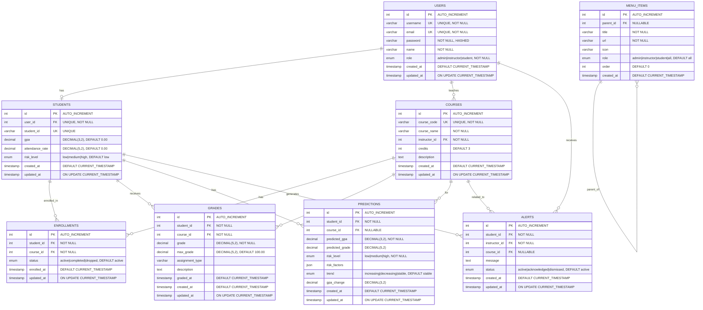

# Software Design Document (SDD)
## EduPredict - Academic Performance Prediction System

**Version:** 1.0  
**Date:** 2024  
**Author:** Development Team  
**Status:** Final

---

## Table of Contents

1. [Introduction](#1-introduction)
2. [System Overview](#2-system-overview)
3. [Design Viewpoints](#3-design-viewpoints)
4. [Data Design (ER Schema)](#4-data-design-er-schema)
5. [User Interface Design](#5-user-interface-design)
6. [Project Plan](#7-project-plan)
7. [Task Distribution](#8-task-distribution)

---

## 1. Introduction

### 1.1 Purpose

This Software Design Document (SDD) provides a comprehensive description of the design and architecture of the **EduPredict** system. The document details the system's structural components, design patterns, data models, user interfaces, and implementation strategies. It serves as a technical blueprint for developers, system architects, and stakeholders involved in the development, maintenance, and enhancement of the academic performance prediction platform.

The SDD outlines how the system addresses the core requirements of predicting student academic performance using machine learning algorithms, managing user roles and permissions, tracking grades and attendance, and generating actionable insights for educational institutions.

### 1.2 Scope

The EduPredict system encompasses the following functional areas:

- **User Management:** Registration, authentication, and role-based access control for three distinct user types (Admin, Instructor, Student)
- **Course Management:** Creation, assignment, and enrollment of courses within the academic system
- **Grade Tracking:** Recording and management of student grades across multiple courses and assignments
- **Machine Learning Predictions:** KNN-based prediction of student GPA and identification of at-risk students
- **Dashboard Analytics:** Visualization of student performance metrics, risk assessments, and trend analysis
- **Alert System:** Automated generation of alerts for instructors when students are identified as high-risk

**Out of Scope:**

The following features and integrations are explicitly excluded from the current system scope:

- Payment processing or financial transaction management
- Integration with external Human Resources (HR) systems
- Student enrollment fee management
- External Learning Management System (LMS) integrations
- Mobile application development (web-based interface only)
- Real-time communication features (chat, video conferencing)
- Third-party authentication providers (OAuth, SSO)

### 1.3 Intended Audience

This document is intended for the following audiences:

- **Developers:** Software engineers and programmers responsible for implementing, maintaining, and extending the system codebase
- **Project Managers:** Individuals overseeing project timelines, resource allocation, and stakeholder communication
- **Academic Stakeholders:** Administrators, faculty members, and institutional decision-makers who need to understand system capabilities and limitations
- **Quality Assurance Engineers:** Testers responsible for validating system functionality and performance
- **System Architects:** Technical leaders who will review and approve the architectural decisions and design patterns

### 1.4 Definitions and Acronyms

**MVC (Model-View-Controller):** A software architectural pattern that separates an application into three interconnected components:
- **Model:** Manages data, business logic, and database interactions
- **View:** Handles presentation and user interface rendering
- **Controller:** Processes user input, coordinates between Model and View, and manages application flow

**KNN (K-Nearest Neighbors):** A supervised machine learning algorithm used for classification and regression. In EduPredict, KNN calculates the Euclidean distance between a student's feature vector (GPA, attendance rate, assignment completion) and historical student data to predict academic performance and risk levels.

**GPA (Grade Point Average):** A numerical representation of a student's academic performance, calculated on a scale (typically 0.0 to 4.0 in the system). GPA is computed from course grades and serves as a primary metric for performance prediction.

**RBAC (Role-Based Access Control):** A security model that restricts system access based on user roles. In EduPredict, three roles are defined:
- **Admin:** Full system access, user management, model training
- **Instructor:** Course management, grade entry, student risk viewing
- **Student:** Personal dashboard, grade viewing, prediction access

**PDO (PHP Data Objects):** A PHP extension providing a consistent interface for accessing databases, used in EduPredict for secure MySQL interactions.

**Singleton Pattern:** A creational design pattern that ensures a class has only one instance and provides global access to that instance. Used in EduPredict for database connection management.

**Factory Pattern:** A creational design pattern that provides an interface for creating objects without specifying their exact classes. Used in EduPredict for dynamic model instantiation.

**Strategy Pattern:** A behavioral design pattern that defines a family of algorithms, encapsulates each one, and makes them interchangeable. Used in EduPredict for entity-specific validation rules.

---

## 2. System Overview

EduPredict is a web-based application designed to predict student academic performance and identify at-risk students through machine learning algorithms. The system follows a three-tier architecture, separating presentation, business logic, and data persistence layers.

### 2.1 Web-Based Architecture

The system operates as a traditional web application, accessible through standard web browsers. Users interact with the system via HTTP/HTTPS requests, and the server processes these requests to generate dynamic HTML responses. The architecture supports both development and production environments, with optional HTTPS enforcement for secure data transmission.

### 2.2 System Components Interaction

The system consists of three primary layers:

**Client Layer (Browser):**
- Users access the application through web browsers (Chrome, Firefox, Safari, Edge)
- The browser renders HTML/CSS for presentation and executes JavaScript for client-side validation and dynamic interactions
- User actions (clicks, form submissions) generate HTTP requests to the web server

**Application Layer (Web Server - Apache/PHP):**
- **Apache HTTP Server:** Handles incoming HTTP requests, serves static assets (CSS, JavaScript, images), and forwards PHP requests to the PHP interpreter
- **PHP 8.2+ Interpreter:** Executes server-side logic, processes MVC routing, and coordinates between controllers, models, and services
- **MVC Framework:** 
  - **Router:** Parses URLs and dispatches requests to appropriate controllers
  - **Controllers:** Handle user input, invoke business logic, and prepare data for views
  - **Models:** Manage database interactions and data persistence
  - **Services:** Contain business logic, including KNN prediction algorithms
  - **Views:** Generate HTML output using PHP templating

**Data Layer (MySQL Database):**
- **MySQL Database Server:** Stores all persistent data including user accounts, student records, courses, grades, and predictions
- **PDO Interface:** Provides secure, parameterized database queries to prevent SQL injection
- **Database Connection:** Managed through a Singleton pattern to ensure a single, shared connection pool

### 2.3 Request-Response Flow

1. **User Request:** A user navigates to a URL (e.g., `/projecty/public/index.php?controller=dashboard&action=student`)
2. **Front Controller:** The `index.php` file acts as a single entry point, initializing configuration, autoloading classes, and instantiating the Router
3. **Routing:** The Router parses the URL parameters, identifies the target controller and action, and checks authentication/authorization
4. **Controller Execution:** The appropriate controller method is invoked, which may:
   - Retrieve data from models
   - Invoke service layer methods (e.g., prediction generation)
   - Prepare data arrays for view rendering
5. **View Rendering:** The controller loads the corresponding view template, which generates HTML with embedded data
6. **Response:** The generated HTML is sent back to the client browser, which renders the page and executes any embedded JavaScript

### 2.4 Technology Stack Summary

- **Backend:** PHP 8.2+ (Object-Oriented Programming)
- **Database:** MySQL 5.7+ (Relational Database Management System)
- **Web Server:** Apache HTTP Server
- **Frontend:** HTML5, CSS3, JavaScript (ES6+)
- **Libraries:** Chart.js (data visualization), Font Awesome (icons)
- **Testing:** PHPUnit (unit testing framework)

---

## 3. Design Viewpoints

This section describes the system from multiple architectural perspectives, providing a comprehensive view of how components interact and how the system behaves under various scenarios.

### 3.1 Context Diagram

The Context Diagram illustrates EduPredict as a central system interacting with three primary external actors: Admin, Instructor, and Student. Each actor represents a distinct user role with specific responsibilities and access privileges.

**System Boundary:**
EduPredict sits at the center of the diagram, representing the entire application ecosystem, including the web server, application logic, and database.

**External Actors:**

1. **Admin:**
   - Manages system-wide configurations
   - Creates and manages user accounts (instructors and students)
   - Creates and assigns courses to instructors
   - Trains and retrains the KNN machine learning model
   - Views system-wide analytics and reports
   - Manages system settings and security configurations

2. **Instructor:**
   - Views assigned courses and enrolled students
   - Enters and updates student grades for assignments and exams
   - Views student performance predictions and risk assessments
   - Receives alerts for at-risk students
   - Manages course-specific alerts and notifications

3. **Student:**
   - Views personal dashboard with current GPA, attendance, and course enrollment
   - Accesses predicted GPA and performance trends
   - Views individual course grades and assignments
   - Reviews risk factors and areas for improvement
   - Monitors academic progress over time

**Data Flows:**
- **From Actors to System:** Authentication credentials, grade entries, course creation requests, model training triggers
- **From System to Actors:** Dashboard data, prediction results, risk alerts, grade confirmations, authentication responses

The Context Diagram emphasizes that EduPredict serves as an intermediary platform, processing academic data and generating predictive insights to support educational decision-making.

### 3.2 Use Case Diagram

The Use Case Diagram identifies the primary functional requirements of the system and maps them to the actors who can perform each use case.

**Primary Use Cases:**

1. **Authentication Use Cases:**
   - **Login:** All actors (Admin, Instructor, Student) authenticate to access the system
   - **Logout:** All actors can securely end their session
   - **Register:** New users (typically students) can create accounts (subject to admin approval in some configurations)

2. **User Management Use Cases (Admin Only):**
   - **Create User:** Admin creates new user accounts for instructors and students
   - **Update User:** Admin modifies user information and roles
   - **Delete User:** Admin removes user accounts from the system
   - **View Users:** Admin views a list of all system users

3. **Course Management Use Cases:**
   - **Create Course:** Admin creates new courses and assigns them to instructors
   - **Enroll Student:** Admin or Instructor enrolls students in courses
   - **View Courses:** All actors view courses (scope varies by role)
   - **Update Course:** Admin modifies course details

4. **Grade Management Use Cases (Instructor Only):**
   - **Enter Grade:** Instructor records student grades for assignments or exams
   - **Update Grade:** Instructor modifies previously entered grades
   - **View Grades:** Instructor views all grades for students in their courses

5. **Prediction Use Cases:**
   - **Generate Prediction:** System automatically generates GPA predictions when grades are added or courses are enrolled (triggered by Admin, Instructor, or system events)
   - **Train KNN Model:** Admin triggers the training of the machine learning model using historical student data
   - **View Predictions:** All actors view predictions (scope varies: Admin sees all, Instructor sees their students, Student sees only their own)

6. **Dashboard Use Cases:**
   - **View Dashboard:** All actors access role-specific dashboards with relevant metrics and summaries
   - **View At-Risk Students:** Admin and Instructor view lists of students identified as high-risk

7. **Alert Management Use Cases (Instructor Only):**
   - **View Alerts:** Instructor views alerts for at-risk students
   - **Manage Alerts:** Instructor acknowledges or dismisses alerts

**Use Case Relationships:**
- **Include Relationship:** "Generate Prediction" is included in "Enter Grade" and "Enroll Student" use cases (automatic trigger)
- **Extend Relationship:** "View At-Risk Students" extends "View Dashboard" when risk data is available

### 3.3 Sequence Diagrams

The Sequence Diagram for the "Generate Prediction" use case illustrates the chronological flow of interactions between system components when a prediction is triggered.

**Scenario: Instructor Enters a Grade, Triggering Prediction Generation**

1. **User Action:** Instructor submits a grade entry form through the web interface
2. **HTTP Request:** Browser sends POST request to `/projecty/public/index.php?controller=grade&action=create`
3. **Front Controller (index.php):** Receives request, initializes session, loads configuration, and instantiates Router
4. **Router:** Parses URL, identifies `GradeController` and `create` action, checks authentication and authorization (verifies Instructor role)
5. **GradeController::create():** 
   - Validates input data using `ValidationStrategy` (Strategy pattern)
   - Instantiates `GradeModel` via `ModelFactory` (Factory pattern)
   - Calls `GradeModel::create()` to persist grade to database
6. **GradeModel::create():**
   - Uses `Database::getInstance()` (Singleton pattern) to obtain database connection
   - Executes parameterized INSERT query to store grade
   - Calls `triggerPrediction()` method after successful insertion
7. **GradeModel::triggerPrediction():**
   - Retrieves student's current GPA and attendance rate from database
   - Instantiates `PredictionService`
   - Identifies all courses the student is enrolled in
8. **PredictionService::predictPerformance():**
   - For each enrolled course:
     - Retrieves all grades for the student in that course
     - Calculates average grade percentage
     - Converts percentage to GPA using `gradeToGpa()` method
   - Calculates overall predicted GPA as average of all course GPAs
   - Retrieves student's current stored GPA for comparison
   - Calculates GPA trend (increase/decrease/stable)
   - Invokes `KNNPredictor::predict()` for risk level assessment
9. **KNNPredictor::predict():**
   - Loads training data (historical student records with features: GPA, attendance, assignment completion)
   - Calculates Euclidean distances between current student features and training samples
   - Identifies K nearest neighbors (typically K=5)
   - Determines risk level based on majority classification of neighbors
   - Returns risk level (low, medium, high)
10. **PredictionService::identifyRiskFactors():**
    - Analyzes student data (GPA, attendance, assignment completion)
    - Generates list of specific risk factors (e.g., "Low GPA (2.1)", "Incomplete assignments")
    - Returns risk factors array
11. **PredictionService::savePrediction():**
    - Prepares prediction data (predicted GPA, risk level, risk factors, trend)
    - Calls `PredictionModel::create()` to persist prediction to database
12. **PredictionModel::create():**
    - Uses database connection to INSERT prediction record
    - Links prediction to student and course (if course-specific)
13. **GradeController::create():**
    - Receives success confirmation
    - Sets flash message: "Grade added successfully. Prediction updated."
    - Redirects to grade list or dashboard
14. **HTTP Response:** Server sends redirect response (302) to browser
15. **Browser:** Follows redirect and requests updated dashboard page
16. **View Rendering:** Dashboard view displays updated prediction data, including new predicted GPA and trend indicators

**Key Design Patterns Demonstrated:**
- **Singleton:** Database connection is shared across all model instances
- **Factory:** ModelFactory creates GradeModel and PredictionModel instances
- **Strategy:** ValidationStrategy provides flexible validation rules
- **Observer-like:** Automatic prediction trigger when grade is created

### 3.4 Class Diagram

The Class Diagram illustrates the static structure of the system, showing classes, their attributes, methods, and relationships.

**Core MVC Classes:**

1. **Controller Base Class (`App\Core\Controller`):**
   - Attributes: `$modelFactory`, `$viewPath`
   - Methods: `view()`, `requireAuth()`, `requireRole()`, `redirect()`
   - Serves as base class for all controllers (AuthController, DashboardController, GradeController, PredictionController, CrudController)

2. **Model Base Class (`App\Core\Model`):**
   - Attributes: `$db` (database connection via Singleton)
   - Methods: `getConnection()`, `validate()`
   - Base class for all model classes

3. **Specific Controllers:**
   - **AuthController:** Handles login, logout, registration
   - **DashboardController:** Role-specific dashboard rendering (admin, instructor, student)
   - **GradeController:** Grade CRUD operations
   - **PredictionController:** Prediction viewing and model training
   - **CrudController:** Generic CRUD operations for users, courses, enrollments

4. **Specific Models:**
   - **UserModel:** Manages user accounts, authentication, role queries
   - **StudentModel:** Student-specific data, GPA calculations, at-risk student queries
   - **CourseModel:** Course management, instructor-course relationships
   - **GradeModel:** Grade persistence, prediction triggers
   - **PredictionModel:** Prediction storage and retrieval
   - **EnrollmentModel:** Student-course enrollment relationships

5. **Service Classes:**
   - **PredictionService:** Core business logic for GPA calculation, risk assessment, prediction generation
   - **KNNPredictor:** Machine learning algorithm implementation (Euclidean distance, K-nearest neighbors)

6. **Design Pattern Implementations:**

   **Singleton Pattern (`App\Core\Database`):**
   - Private static attribute: `$instance`
   - Private constructor: Prevents direct instantiation
   - Public static method: `getInstance()` - Returns single database connection instance
   - Private `__clone()` and `__wakeup()`: Prevent cloning and unserialization

   **Factory Pattern (`App\Core\Factory\ModelFactory`):**
   - Private static attribute: `$instances` (caching)
   - Public static method: `create($type)` - Creates and caches model instances based on type string
   - Returns: UserModel, StudentModel, CourseModel, GradeModel, etc.

   **Strategy Pattern (`App\Core\Strategy\ValidationStrategy`):**
   - Interface: `ValidationStrategy` with methods `validate($data)` and `getErrors()`
   - Concrete strategies: `UserValidationStrategy`, `CourseValidationStrategy`, `GradeValidationStrategy`
   - Each strategy implements entity-specific validation rules

7. **Supporting Classes:**
   - **Router:** URL parsing, route dispatching, authentication middleware
   - **Validator:** Server-side validation utilities
   - **Session:** Session management wrapper

**Class Relationships:**
- **Inheritance:** All controllers extend `Controller`, all models extend `Model`
- **Composition:** Controllers contain references to Models (via Factory) and Services
- **Dependency:** Services depend on Models for data access
- **Association:** Models use Database Singleton for persistence

### 3.5 State Diagram

The State Diagram describes the lifecycle of a student's risk status within the EduPredict system, showing how risk levels transition based on data availability and prediction results.

**States:**

1. **No Data:**
   - **Entry Condition:** New student account created, no grades or enrollment data exists
   - **Characteristics:** Student record exists in database, but GPA is null or 0.0, no predictions generated
   - **Display:** Dashboard shows "Insufficient data for prediction" or similar message
   - **Transitions:**
     - When student is enrolled in at least one course → **Calculating**
     - When first grade is entered → **Calculating**

2. **Calculating:**
   - **Entry Condition:** System has initiated prediction generation (grade added, course enrolled, or manual trigger)
   - **Characteristics:** PredictionService is executing KNN algorithm, retrieving training data, computing distances
   - **Display:** System may show "Generating prediction..." or processing indicator
   - **Transitions:**
     - When prediction completes with risk_level = "low" → **Low Risk**
     - When prediction completes with risk_level = "medium" → **Medium Risk**
     - When prediction completes with risk_level = "high" → **High Risk**
     - If calculation fails or insufficient training data → **No Data** (with error logging)

3. **Low Risk:**
   - **Entry Condition:** Predicted GPA is above threshold (e.g., ≥ 3.0), attendance is satisfactory, assignments are complete
   - **Characteristics:** Student is performing well, no immediate intervention needed
   - **Display:** Dashboard shows green indicators, positive trend messages, "On Track" status
   - **Transitions:**
     - When new grade is entered that lowers GPA significantly → **Calculating** (re-evaluation)
     - When attendance drops below threshold → **Calculating** (re-evaluation)
     - When multiple assignments are missed → **Calculating** (re-evaluation)
     - If no updates occur for extended period → remains **Low Risk** (stable state)

4. **Medium Risk:**
   - **Entry Condition:** Predicted GPA is in moderate range (e.g., 2.0-2.9), some risk factors present (low attendance, incomplete assignments)
   - **Characteristics:** Student shows signs of struggle but not critical
   - **Display:** Dashboard shows yellow/orange indicators, "Needs Attention" status, list of risk factors
   - **Transitions:**
     - When performance improves (grades increase, attendance improves) → **Calculating** → potentially **Low Risk**
     - When performance deteriorates (grades drop further, more assignments missed) → **Calculating** → potentially **High Risk**
     - When new grade is entered → **Calculating** (re-evaluation)

5. **High Risk:**
   - **Entry Condition:** Predicted GPA is below threshold (e.g., < 2.0), multiple risk factors present (very low attendance, many incomplete assignments, declining trend)
   - **Characteristics:** Student requires immediate intervention, instructor should be notified
   - **Display:** Dashboard shows red indicators, "At Risk" status, detailed risk factor list, alert badges
   - **Actions Triggered:** System automatically generates alert for instructor
   - **Transitions:**
     - When performance improves significantly (grades increase substantially, attendance recovers) → **Calculating** → potentially **Medium Risk** or **Low Risk**
     - When new grade is entered → **Calculating** (re-evaluation)
     - If student withdraws or is removed from courses → **No Data**

6. **Alert Generated:**
   - **Entry Condition:** Student transitions to **High Risk** state
   - **Characteristics:** Alert record created in database, linked to student and instructor
   - **Display:** Instructor dashboard shows alert notification, alert appears in alerts list
   - **Transitions:**
     - When instructor acknowledges alert → remains **High Risk** (alert marked as acknowledged, but risk state persists until performance improves)
     - When student risk level changes (improves) → **Medium Risk** or **Low Risk** (alert may be auto-dismissed or remain for historical record)

**State Transition Triggers:**
- **Data Changes:** New grade entry, course enrollment, attendance update
- **Time-Based:** Periodic re-evaluation (if implemented)
- **Manual:** Admin or Instructor triggers prediction refresh
- **Automatic:** System triggers prediction when relevant data changes

**Guard Conditions:**
- Transitions to **Calculating** require: At least one course enrollment AND at least one grade entry (for accurate prediction)
- Transitions to **High Risk** require: Multiple risk factors OR very low GPA (< 2.0) OR declining trend

---

## 4. Data Design (ER Schema)

The database schema for EduPredict follows a normalized relational design, ensuring data integrity and minimizing redundancy. The schema supports the core entities of the academic prediction system and their relationships.

### 4.1 Entity-Relationship Diagram

The following Mermaid ER diagram illustrates the database structure, showing all entities, their attributes, and the relationships between them:

**Diagram Legend:**
- **PK** = Primary Key
- **FK** = Foreign Key
- **UK** = Unique Key
- **||--o|** = One-to-One relationship (one user has zero or one student profile)
- **||--o{** = One-to-Many relationship (one user teaches many courses)
- **}o--o{** = Many-to-Many relationship (implemented via ENROLLMENTS junction table)

### 4.2 Database Schema Overview

The database consists of eight primary tables that model users, academic entities, and prediction data. All tables use integer primary keys with auto-increment, and foreign key relationships enforce referential integrity.

### 4.2 Core Tables

#### 4.2.1 `users` Table
**Purpose:** Stores authentication and profile information for all system users (Admin, Instructor, Student).

**Fields:**
- `id` (INT, PRIMARY KEY, AUTO_INCREMENT): Unique user identifier
- `username` (VARCHAR(50), UNIQUE, NOT NULL): Login username
- `email` (VARCHAR(100), UNIQUE, NOT NULL): User email address
- `password` (VARCHAR(255), NOT NULL): Hashed password (bcrypt)
- `name` (VARCHAR(100), NOT NULL): Full name of user
- `role` (ENUM('admin', 'instructor', 'student'), NOT NULL): User role for RBAC
- `created_at` (TIMESTAMP, DEFAULT CURRENT_TIMESTAMP): Account creation timestamp
- `updated_at` (TIMESTAMP, ON UPDATE CURRENT_TIMESTAMP): Last update timestamp

**Relationships:**
- One-to-One with `students` table (via `user_id` foreign key)
- One-to-Many with `courses` table (instructor_id references users.id)

#### 4.2.2 `students` Table
**Purpose:** Stores student-specific academic data used for predictions.

**Fields:**
- `id` (INT, PRIMARY KEY, AUTO_INCREMENT): Unique student record identifier
- `user_id` (INT, FOREIGN KEY → users.id, UNIQUE, NOT NULL): Links to users table
- `student_id` (VARCHAR(20), UNIQUE): Institutional student ID
- `gpa` (DECIMAL(3,2), DEFAULT 0.00): Current Grade Point Average (0.00-4.00)
- `attendance_rate` (DECIMAL(5,2), DEFAULT 0.00): Attendance percentage (0.00-100.00)
- `risk_level` (ENUM('low', 'medium', 'high'), DEFAULT 'low'): Current risk assessment
- `created_at` (TIMESTAMP, DEFAULT CURRENT_TIMESTAMP): Record creation timestamp
- `updated_at` (TIMESTAMP, ON UPDATE CURRENT_TIMESTAMP): Last update timestamp

**Relationships:**
- Many-to-One with `users` table (each student has one user account)
- One-to-Many with `enrollments` table
- One-to-Many with `grades` table
- One-to-Many with `predictions` table

#### 4.2.3 `courses` Table
**Purpose:** Stores course information and instructor assignments.

**Fields:**
- `id` (INT, PRIMARY KEY, AUTO_INCREMENT): Unique course identifier
- `course_code` (VARCHAR(20), UNIQUE, NOT NULL): Course code (e.g., "CS101")
- `course_name` (VARCHAR(100), NOT NULL): Full course name
- `instructor_id` (INT, FOREIGN KEY → users.id, NOT NULL): Assigned instructor
- `credits` (INT, DEFAULT 3): Credit hours for the course
- `description` (TEXT): Course description
- `created_at` (TIMESTAMP, DEFAULT CURRENT_TIMESTAMP): Course creation timestamp
- `updated_at` (TIMESTAMP, ON UPDATE CURRENT_TIMESTAMP): Last update timestamp

**Relationships:**
- Many-to-One with `users` table (instructor)
- One-to-Many with `enrollments` table
- One-to-Many with `grades` table
- One-to-Many with `predictions` table

#### 4.2.4 `enrollments` Table
**Purpose:** Manages the many-to-many relationship between students and courses (enrollment records).

**Fields:**
- `id` (INT, PRIMARY KEY, AUTO_INCREMENT): Unique enrollment identifier
- `student_id` (INT, FOREIGN KEY → students.id, NOT NULL): Enrolled student
- `course_id` (INT, FOREIGN KEY → courses.id, NOT NULL): Course being taken
- `status` (ENUM('active', 'completed', 'dropped'), DEFAULT 'active'): Enrollment status
- `enrolled_at` (TIMESTAMP, DEFAULT CURRENT_TIMESTAMP): Enrollment date
- `updated_at` (TIMESTAMP, ON UPDATE CURRENT_TIMESTAMP): Last update timestamp
- UNIQUE KEY (`student_id`, `course_id`): Prevents duplicate enrollments

**Relationships:**
- Many-to-One with `students` table
- Many-to-One with `courses` table

#### 4.2.5 `grades` Table
**Purpose:** Stores individual grade entries for assignments, exams, and assessments.

**Fields:**
- `id` (INT, PRIMARY KEY, AUTO_INCREMENT): Unique grade identifier
- `student_id` (INT, FOREIGN KEY → students.id, NOT NULL): Student who received the grade
- `course_id` (INT, FOREIGN KEY → courses.id, NOT NULL): Course for which grade was given
- `grade` (DECIMAL(5,2), NOT NULL): Grade value (points earned)
- `max_grade` (DECIMAL(5,2), DEFAULT 100.00): Maximum possible grade (for percentage calculation)
- `assignment_type` (VARCHAR(50)): Type of assessment (e.g., "Exam", "Assignment", "Project")
- `description` (TEXT): Description or name of the assignment
- `graded_at` (TIMESTAMP, DEFAULT CURRENT_TIMESTAMP): When grade was recorded
- `created_at` (TIMESTAMP, DEFAULT CURRENT_TIMESTAMP): Record creation timestamp
- `updated_at` (TIMESTAMP, ON UPDATE CURRENT_TIMESTAMP): Last update timestamp

**Relationships:**
- Many-to-One with `students` table
- Many-to-One with `courses` table

#### 4.2.6 `predictions` Table
**Purpose:** Stores machine learning prediction results for students (course-specific and overall).

**Fields:**
- `id` (INT, PRIMARY KEY, AUTO_INCREMENT): Unique prediction identifier
- `student_id` (INT, FOREIGN KEY → students.id, NOT NULL): Student for whom prediction was generated
- `course_id` (INT, FOREIGN KEY → courses.id, NULL): Course-specific prediction (NULL for overall prediction)
- `predicted_gpa` (DECIMAL(3,2), NOT NULL): Predicted GPA value (0.00-4.00)
- `predicted_grade` (DECIMAL(5,2)): Predicted grade percentage (for display, calculated from GPA)
- `risk_level` (ENUM('low', 'medium', 'high'), NOT NULL): Predicted risk level
- `risk_factors` (JSON): Array of risk factor strings (e.g., ["Low GPA (2.1)", "Incomplete assignments"])
- `trend` (ENUM('increasing', 'decreasing', 'stable'), DEFAULT 'stable'): GPA trend direction
- `gpa_change` (DECIMAL(3,2)): Change in GPA from current to predicted (positive = increase, negative = decrease)
- `created_at` (TIMESTAMP, DEFAULT CURRENT_TIMESTAMP): Prediction generation timestamp
- `updated_at` (TIMESTAMP, ON UPDATE CURRENT_TIMESTAMP): Last update timestamp

**Relationships:**
- Many-to-One with `students` table
- Many-to-One with `courses` table (nullable, for overall predictions)

#### 4.2.7 `alerts` Table
**Purpose:** Stores automated alerts generated for instructors when students are identified as high-risk.

**Fields:**
- `id` (INT, PRIMARY KEY, AUTO_INCREMENT): Unique alert identifier
- `student_id` (INT, FOREIGN KEY → students.id, NOT NULL): At-risk student
- `instructor_id` (INT, FOREIGN KEY → users.id, NOT NULL): Instructor to be notified
- `course_id` (INT, FOREIGN KEY → courses.id, NULL): Course context (if course-specific)
- `message` (TEXT): Alert message describing the risk
- `status` (ENUM('active', 'acknowledged', 'dismissed'), DEFAULT 'active'): Alert status
- `created_at` (TIMESTAMP, DEFAULT CURRENT_TIMESTAMP): Alert generation timestamp
- `updated_at` (TIMESTAMP, ON UPDATE CURRENT_TIMESTAMP): Last update timestamp

**Relationships:**
- Many-to-One with `students` table
- Many-to-One with `users` table (instructor)
- Many-to-One with `courses` table (nullable)

#### 4.2.8 `menu_items` Table
**Purpose:** Stores dynamic, self-referential menu structure for role-based navigation.

**Fields:**
- `id` (INT, PRIMARY KEY, AUTO_INCREMENT): Unique menu item identifier
- `parent_id` (INT, FOREIGN KEY → menu_items.id, NULL): Parent menu item (for hierarchical structure, NULL for top-level)
- `title` (VARCHAR(100), NOT NULL): Menu item display text
- `url` (VARCHAR(255), NOT NULL): URL or route for the menu item
- `icon` (VARCHAR(50)): Icon class name (e.g., Font Awesome class)
- `role` (ENUM('admin', 'instructor', 'student', 'all'), DEFAULT 'all'): Role required to see this menu item
- `order` (INT, DEFAULT 0): Display order (sorting)
- `created_at` (TIMESTAMP, DEFAULT CURRENT_TIMESTAMP): Record creation timestamp

**Relationships:**
- Self-referential: `parent_id` references `menu_items.id` (supports nested menu structures)

### 4.3 Entity Relationships

**One-to-Many Relationships:**
- **User → Students:** One user account can be associated with one student record (via user_id)
- **User → Courses:** One instructor (user) can teach many courses
- **Student → Enrollments:** One student can have many course enrollments
- **Course → Enrollments:** One course can have many student enrollments
- **Student → Grades:** One student can have many grade entries
- **Course → Grades:** One course can have many grade entries
- **Student → Predictions:** One student can have many predictions (one per course + one overall)
- **Course → Predictions:** One course can have many predictions (one per enrolled student)
- **Student → Alerts:** One student can generate many alerts (if risk persists)
- **Instructor → Alerts:** One instructor can receive many alerts (for different students)
- **Menu Item → Menu Item:** One menu item can have many child menu items (hierarchical menu)

**Many-to-Many Relationships:**
- **Students ↔ Courses:** Implemented through the `enrollments` junction table
  - A student can enroll in multiple courses
  - A course can have multiple enrolled students

### 4.4 Data Integrity Constraints

- **Foreign Key Constraints:** All foreign key relationships enforce referential integrity (CASCADE on delete/update where appropriate)
- **Unique Constraints:** 
  - `users.username` and `users.email` are unique
  - `students.student_id` is unique
  - `courses.course_code` is unique
  - `enrollments(student_id, course_id)` combination is unique (prevents duplicate enrollments)
- **Check Constraints:** 
  - `students.gpa` should be between 0.00 and 4.00 (enforced at application level)
  - `students.attendance_rate` should be between 0.00 and 100.00 (enforced at application level)
- **NOT NULL Constraints:** Critical fields (user_id, student_id, course_id, etc.) are marked NOT NULL to prevent incomplete data

### 4.5 Indexes

- Primary keys are automatically indexed
- Foreign keys are indexed for join performance
- `users.email` and `users.username` are indexed (unique indexes)
- `students.student_id` is indexed (unique index)
- `courses.course_code` is indexed (unique index)
- Composite index on `enrollments(student_id, course_id)` for efficient enrollment queries

---

## 5. User Interface Design

The EduPredict user interface follows a modern, responsive web design that provides an intuitive experience across different user roles. The interface emphasizes clarity, accessibility, and role-appropriate information presentation.

### 5.1 Overall Layout Structure

The application uses a consistent layout template across all pages, consisting of three primary sections:

**5.1.1 Sidebar Navigation:**
- **Location:** Left side of the screen (collapsible on mobile devices)
- **Content:** Dynamic menu items loaded from the `menu_items` table, filtered by user role
- **Features:**
  - Hierarchical menu structure (parent-child relationships)
  - Icon support (Font Awesome icons)
  - Active page highlighting
  - Role-based visibility (Admin sees admin items, Instructor sees instructor items, Student sees student items)
- **Menu Items (Examples):**
  - **Admin:** Dashboard, Users, Courses, Students, Predictions, Train Model, Settings
  - **Instructor:** Dashboard, My Courses, Grades, Predictions, Alerts
  - **Student:** Dashboard, My Courses, Grades, Predictions, Profile

**5.1.2 Top Header:**
- **Location:** Top of the page, spanning full width
- **Content:**
  - Application logo/branding ("EduPredict")
  - User information (name, role badge)
  - Notification indicators (alert count for instructors)
  - Logout button
- **Styling:** Fixed position, shadow for depth, responsive to screen size

**5.1.3 Main Content Area:**
- **Location:** Center-right portion of the screen, below header, beside sidebar
- **Content:** Dynamic content based on current page/route
- **Features:**
  - Responsive grid layouts for cards and statistics
  - Breadcrumb navigation (where applicable)
  - Flash message notifications (success, error, warning)
  - Page-specific content (tables, forms, charts, dashboards)

### 5.2 Dashboard Views

#### 5.2.1 Admin Dashboard
**Purpose:** Provides system-wide overview and management access.

**Layout Components:**
- **Statistics Cards (Top Row):**
  - Total Users (with breakdown by role: Admin, Instructor, Student)
  - Total Courses
  - Total Students
  - System Status (model training status, last training date)
- **Charts Section:**
  - Bar chart: User distribution by role (Chart.js)
  - Line chart: Student enrollment trends over time
  - Pie chart: Risk level distribution (Low/Medium/High risk students)
- **Quick Actions:**
  - Buttons: "Create User", "Create Course", "Train KNN Model"
- **Recent Activity Table:**
  - List of recent user creations, course assignments, prediction generations

**Visual Design:**
- Color scheme: Blue/indigo primary colors for admin authority
- Cards use subtle shadows and hover effects
- Charts are interactive (tooltips, legends)

#### 5.2.2 Instructor Dashboard
**Purpose:** Displays course-specific information and student risk alerts.

**Layout Components:**
- **Statistics Cards:**
  - Total Courses Taught
  - Total Students Enrolled
  - Active Alerts Count (highlighted in red if > 0)
  - Average Class GPA
- **My Courses Section:**
  - Card grid showing each assigned course
  - Each card displays: Course name, enrolled student count, average GPA for course
  - Click to navigate to course details
- **At-Risk Students Section:**
  - Table listing students with `risk_level = 'high'`
  - Columns: Student Name, Course, Current GPA, Risk Factors, Actions (View Details, Generate Alert)
  - Red highlighting for urgent attention
- **Recent Grades Section:**
  - List of recently entered grades with student and course information

**Visual Design:**
- Color scheme: Green/teal primary colors for instructor role
- Alert badges use red/orange for high visibility
- At-risk student table rows have light red background

#### 5.2.3 Student Dashboard
**Purpose:** Personal academic overview and performance tracking.

**Layout Components:**
- **Performance Overview Cards:**
  - Current GPA (large, prominent display with trend indicator: ↑ increasing, ↓ decreasing, → stable)
  - Attendance Rate (percentage with progress bar)
  - Enrolled Courses Count
  - **Predicted GPA** (new card showing predicted GPA with trend comparison: "+0.25 from current" or "-0.10 from current")
- **Predicted Performance Card:**
  - Displays predicted GPA (e.g., "3.45")
  - Trend message: "Your predicted GPA is 3.45, which is +0.25 from your current GPA of 3.20"
  - Visual indicator (green for increase, red for decrease, yellow for stable)
- **My Courses Section:**
  - List of enrolled courses with:
    - Course name and code
    - Current grade/GPA in that course
    - Predicted GPA for that course (if available)
    - Progress indicator
- **Areas to Improve Section:**
  - List of risk factors (if any)
  - Actionable recommendations (e.g., "Complete 2 missing assignments", "Improve attendance in CS101")
- **Grade History Chart:**
  - Line chart showing GPA trend over time (if historical data exists)

**Visual Design:**
- Color scheme: Purple/blue primary colors for student role
- GPA displays use large, readable fonts
- Trend indicators use color-coded arrows and text
- Progress bars for attendance and course completion

### 5.3 Prediction Views

#### 5.3.1 Admin/Instructor Prediction View (`/predictions`)
**Purpose:** System-wide or instructor-scoped prediction overview.

**Layout Components:**
- **Filter Section:**
  - Dropdown: Filter by course, risk level, student
  - Search bar: Search by student name or ID
- **Prediction Table:**
  - Columns: Student Name, Course, Current GPA, **Predicted GPA**, Risk Level, Trend, Risk Factors, Actions
  - Sortable columns (click header to sort)
  - Pagination for large datasets
  - Color-coded risk level badges (green=low, yellow=medium, red=high)
- **Summary Statistics:**
  - Total predictions, Average predicted GPA, Risk distribution

#### 5.3.2 Student Prediction View (`/predictions/student`)
**Purpose:** Personal prediction details for the logged-in student.

**Layout Components:**
- **Overall Prediction Card:**
  - **Overall Predicted GPA:** Large display (e.g., "3.45")
  - Trend message: "Your overall predicted GPA is 3.45, which is +0.25 from your current GPA"
  - Risk level indicator
- **Course-Specific Predictions:**
  - Card for each enrolled course showing:
    - Course name
    - **Predicted GPA for this course** (e.g., "3.50")
    - Trend: "Increasing", "Decreasing", or "Stable"
    - Comparison: "+0.30 from current course GPA"
  - Visual trend indicators (arrows, color coding)
- **Risk Factors List:**
  - Detailed list of identified risk factors
  - Recommendations for improvement

### 5.4 Form Interfaces

**Common Form Elements:**
- **Input Fields:** Text inputs, number inputs, select dropdowns, textareas
- **Validation Feedback:**
  - Client-side: Real-time validation messages (red text below fields)
  - Server-side: Flash messages at top of form
  - Required field indicators (asterisk *)
- **Submit Buttons:** Primary action buttons with loading states
- **Cancel/Back Buttons:** Secondary buttons to navigate away

**Specific Forms:**
- **Login Form:** Username/email and password fields, "Remember Me" checkbox
- **Registration Form:** Username, email, password, confirm password, name fields
- **Grade Entry Form:** Student dropdown, course dropdown, grade value, max grade, assignment type, description
- **Course Creation Form:** Course code, course name, instructor selection (admin) or auto-filled (instructor), credits, description
- **User Creation Form (Admin):** Username, email, password, name, role selection

### 5.5 Responsive Design

- **Desktop (> 1024px):** Full sidebar visible, multi-column layouts, expanded tables
- **Tablet (768px - 1024px):** Collapsible sidebar, 2-column card grids, condensed tables
- **Mobile (< 768px):** Hamburger menu for sidebar, single-column layouts, stacked cards, horizontal-scrolling tables

### 5.6 Accessibility Features

- Semantic HTML5 elements (header, nav, main, section, article)
- ARIA labels for screen readers
- Keyboard navigation support
- Sufficient color contrast ratios
- Alt text for icons and images (where applicable)

---

## 7. Project Plan

This section outlines a hypothetical 12-week development timeline for the EduPredict system, broken down into phases, milestones, and deliverables.

### 7.1 Project Timeline Overview

**Total Duration:** 12 weeks (3 months)  
**Team Size:** 4-5 members (Backend Developer, Frontend Developer, Database Administrator, Project Manager, Optional QA Engineer)

### 7.2 Phase Breakdown

#### **Phase 1: Requirements & Planning (Weeks 1-2)**

**Objectives:**
- Gather and document functional requirements
- Define user stories for each role (Admin, Instructor, Student)
- Create initial database schema design
- Establish development environment and version control

**Deliverables:**
- Requirements Specification Document
- User Story Backlog
- Initial Database ER Diagram
- Development Environment Setup Guide
- Project Repository (Git) initialized

**Milestone:** Requirements Approved (End of Week 2)

---

#### **Phase 2: System Design (Weeks 3-4)**

**Objectives:**
- Finalize MVC architecture and folder structure
- Design database schema with all tables and relationships
- Create UI mockups and wireframes
- Select and document design patterns (Singleton, Factory, Strategy)
- Plan KNN algorithm integration approach

**Deliverables:**
- Software Design Document (SDD) - This document
- Database Schema SQL Scripts
- UI/UX Mockups (Figma or similar)
- Design Pattern Documentation
- API/Route Specification

**Milestone:** Design Review Complete (End of Week 4)

---

#### **Phase 3: Core Infrastructure Implementation (Weeks 5-6)**

**Objectives:**
- Implement MVC framework (Router, Controller base, Model base)
- Set up database connection (Singleton pattern)
- Create database tables and seed initial data
- Implement authentication and session management
- Build dynamic menu system

**Deliverables:**
- Working Router and MVC skeleton
- Database with all tables created
- Login/Logout functionality
- Role-based access control (RBAC) middleware
- Dynamic menu rendering

**Milestone:** Core Infrastructure Complete (End of Week 6)

---

#### **Phase 4: CRUD Operations & User Management (Weeks 7-8)**

**Objectives:**
- Implement ModelFactory (Factory pattern)
- Implement ValidationStrategy (Strategy pattern)
- Build generic CrudController
- Create User, Course, Student, Enrollment CRUD interfaces
- Implement client-side and server-side validation

**Deliverables:**
- ModelFactory class with caching
- ValidationStrategy implementations for each entity
- Admin user management interface (Create, Read, Update, Delete)
- Course management interface
- Student enrollment interface
- Form validation (client and server)

**Milestone:** CRUD Operations Functional (End of Week 8)

---

#### **Phase 5: Grade Management & Prediction System (Weeks 9-10)**

**Objectives:**
- Implement grade entry and management
- Develop KNNPredictor class with Euclidean distance calculation
- Build PredictionService for GPA calculation and risk assessment
- Integrate prediction triggers (automatic on grade entry)
- Create prediction display views

**Deliverables:**
- Grade entry form and management interface
- KNN algorithm implementation
- Prediction generation service
- Prediction views (Admin, Instructor, Student)
- Alert generation system

**Milestone:** Prediction System Operational (End of Week 10)

---

#### **Phase 6: Testing & Refinement (Weeks 11-12)**

**Objectives:**
- Write and execute unit tests (PHPUnit)
- Perform integration testing
- Conduct user acceptance testing (UAT) with stakeholders
- Fix bugs and refine user experience
- Optimize database queries and performance
- Implement optional features (HTTPS enforcement, additional validations)

**Deliverables:**
- Unit test suite (minimum 80% code coverage for core logic)
- Integration test results
- UAT feedback and resolution log
- Bug fix documentation
- Performance optimization report
- Final system documentation

**Milestone:** Beta Release Ready (End of Week 12)

---

### 7.3 Key Milestones

| Milestone | Week | Description | Success Criteria |
|-----------|------|-------------|------------------|
| **Requirements Approved** | 2 | Stakeholder sign-off on requirements | All user stories documented and approved |
| **Design Review Complete** | 4 | Architecture and design finalized | SDD approved, database schema finalized |
| **Core Infrastructure Complete** | 6 | MVC framework and authentication working | Users can log in, RBAC enforced, menu displays |
| **CRUD Operations Functional** | 8 | All entity management interfaces complete | Admin can create/edit/delete users and courses |
| **Prediction System Operational** | 10 | ML predictions generating correctly | Predictions appear after grade entry, risk levels accurate |
| **Beta Release Ready** | 12 | System tested and refined | All tests passing, UAT approved, documentation complete |

### 7.4 Risk Management

**Potential Risks:**
- **KNN Algorithm Complexity:** Mitigation: Prototype KNN early (Week 5), seek ML expertise if needed
- **Performance with Large Datasets:** Mitigation: Implement pagination, optimize queries, consider caching
- **Scope Creep:** Mitigation: Strict change control process, prioritize MVP features
- **Team Availability:** Mitigation: Cross-train team members, document code thoroughly

### 7.5 Post-Launch (Optional Phase 7)

**Weeks 13-14: Deployment & Monitoring**
- Deploy to production server
- Configure HTTPS and security settings
- Set up monitoring and logging
- User training sessions
- Gather initial user feedback

---

## 8. Task Distribution

This section outlines the assignment of responsibilities across team roles for the EduPredict project development.

### 8.1 Team Roles and Responsibilities

| Role | Primary Responsibilities | Key Deliverables | Estimated Effort |
|------|-------------------------|-----------------|------------------|
| **Backend Developer** | • Implement MVC architecture (Router, Controllers, Models) • Develop KNN prediction algorithm • Create business logic services (PredictionService) • Implement design patterns (Singleton, Factory, Strategy) • Build authentication and RBAC system • Write server-side validation logic • Create API endpoints and route handling | • Router.php, Controller.php, Model.php base classes • KNNPredictor.php class • PredictionService.php • ModelFactory.php, ValidationStrategy.php • AuthController.php, Session management • All Controller classes (Dashboard, Grade, Prediction, Crud) • Unit tests for core logic | 40% of project time |
| **Frontend Developer** | • Design and implement UI layouts (HTML/CSS) • Create responsive dashboard views • Implement client-side JavaScript validation • Integrate Chart.js for data visualization • Build form interfaces and user interactions • Ensure cross-browser compatibility • Implement dynamic menu rendering | • All view templates (.php files in app/views/) • CSS stylesheets (responsive design) • JavaScript files (script.js, form validation) • Chart.js integration for dashboards • UI/UX mockups and wireframes | 30% of project time |
| **Database Administrator (DBA)** | • Design database schema (ER modeling) • Create SQL scripts for table creation • Define indexes and foreign key constraints • Optimize database queries • Create seed data for testing • Perform database migrations • Ensure data integrity and security | • Database schema SQL scripts • ER diagram documentation • Migration scripts • Seed data scripts • Query optimization recommendations • Database backup and recovery procedures | 15% of project time |
| **Project Manager** | • Create and maintain project timeline • Facilitate team communication • Manage stakeholder expectations • Track progress against milestones • Coordinate UAT sessions • Write project documentation • Manage risks and issues • Organize code reviews | • Project plan and timeline (this document Section 7) • Weekly status reports • Requirements documentation • UAT coordination and feedback logs • Risk register • Final project report | 15% of project time |

### 8.2 Detailed Task Breakdown by Role

#### **Backend Developer Tasks:**

**Week 1-2: Setup & Planning**
- Set up PHP development environment
- Initialize Git repository structure
- Review requirements and design documents

**Week 3-4: Core Framework**
- Implement Router class with URL parsing and dispatching
- Create base Controller class with view() and redirect() methods
- Create base Model class with database connection
- Implement Database Singleton class
- Build authentication middleware

**Week 5-6: Models & Factories**
- Implement ModelFactory (Factory pattern)
- Create UserModel, StudentModel, CourseModel, GradeModel, PredictionModel
- Implement ValidationStrategy interface and concrete strategies
- Build generic CrudController

**Week 7-8: Controllers & Services**
- Implement AuthController (login, logout, register)
- Implement DashboardController (role-specific dashboards)
- Implement GradeController (grade CRUD)
- Create PredictionService with GPA calculation logic
- Implement KNNPredictor class

**Week 9-10: Prediction Integration**
- Integrate KNN algorithm into PredictionService
- Implement automatic prediction triggers
- Build PredictionController
- Create alert generation logic

**Week 11-12: Testing & Refinement**
- Write PHPUnit tests for core services
- Fix bugs identified in testing
- Optimize prediction algorithm performance
- Code review and refactoring

#### **Frontend Developer Tasks:**

**Week 1-2: Design & Planning**
- Create UI/UX mockups for all dashboards
- Design color schemes and typography
- Plan responsive breakpoints

**Week 3-4: Layout & Structure**
- Build base layout template (sidebar, header, content area)
- Implement dynamic menu rendering (PHP/JavaScript)
- Create CSS framework and styling system

**Week 5-6: Authentication Views**
- Design and implement login page
- Design and implement registration page
- Add client-side form validation (JavaScript)

**Week 7-8: Dashboard Views**
- Implement Admin dashboard (statistics, charts)
- Implement Instructor dashboard (courses, at-risk students)
- Implement Student dashboard (GPA, predictions, courses)
- Integrate Chart.js for data visualization

**Week 9-10: Management Interfaces**
- Build user management interface (Admin)
- Build course management interface
- Build grade entry form (Instructor)
- Create prediction display views

**Week 11-12: Polish & Testing**
- Implement responsive design for mobile/tablet
- Cross-browser testing and fixes
- UI/UX refinements based on feedback
- Accessibility improvements

#### **Database Administrator Tasks:**

**Week 1-2: Schema Design**
- Create initial ER diagram
- Design table structures and relationships
- Define data types and constraints

**Week 3-4: Database Implementation**
- Write SQL scripts for all tables
- Create foreign key relationships
- Define indexes for performance
- Create initial seed data

**Week 5-6: Integration Support**
- Assist Backend Developer with PDO queries
- Optimize database queries for performance
- Create database backup procedures

**Week 7-8: Data Management**
- Create migration scripts for schema changes
- Generate test data for development
- Document database procedures

**Week 9-10: Optimization**
- Analyze query performance
- Recommend and implement indexes
- Optimize prediction-related queries

**Week 11-12: Finalization**
- Final database documentation
- Production database setup procedures
- Data migration plan (if needed)

#### **Project Manager Tasks:**

**Week 1-2: Project Initiation**
- Create project plan and timeline
- Set up project management tools (Jira, Trello, etc.)
- Schedule kickoff meeting
- Document requirements

**Week 3-4: Design Coordination**
- Facilitate design review meetings
- Coordinate between team members
- Update project documentation

**Week 5-6: Progress Tracking**
- Conduct weekly status meetings
- Track progress against milestones
- Identify and escalate blockers

**Week 7-8: Mid-Project Review**
- Conduct mid-project review with stakeholders
- Adjust timeline if necessary
- Update risk register

**Week 9-10: UAT Preparation**
- Prepare UAT test cases
- Coordinate UAT sessions with stakeholders
- Document feedback

**Week 11-12: Project Closure**
- Finalize all documentation
- Conduct project retrospective
- Prepare final project report
- Plan deployment activities

### 8.3 Collaboration Points

**Weekly Standup Meetings:** All team members (15 minutes, Monday mornings)
- Share progress, blockers, and plans for the week

**Design Reviews:** Backend Developer + Frontend Developer + DBA (as needed)
- Review API contracts, database schema changes, UI mockups

**Code Reviews:** Backend Developer + Frontend Developer (peer reviews)
- Ensure code quality, adherence to patterns, security best practices

**Stakeholder Updates:** Project Manager + Key Team Members (bi-weekly)
- Present progress, demo features, gather feedback

---

## Document Control

**Version History:**
- **v1.0** (Current): Initial complete SDD document

**Approval:**
- **Technical Lead:** _________________ Date: _______
- **Project Manager:** _________________ Date: _______
- **Stakeholder:** _________________ Date: _______

---

**End of Document**

