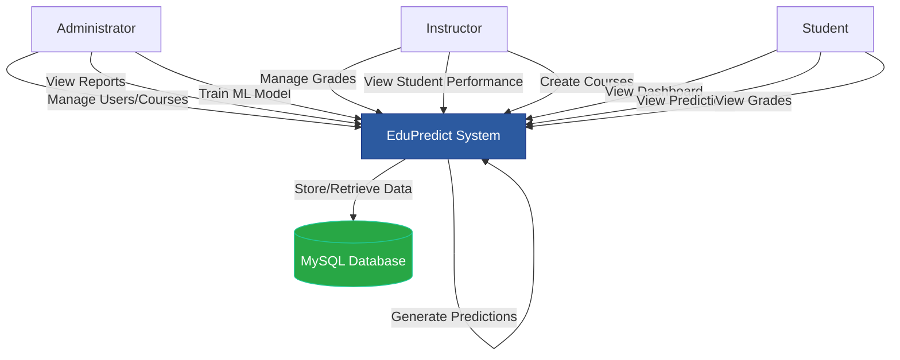
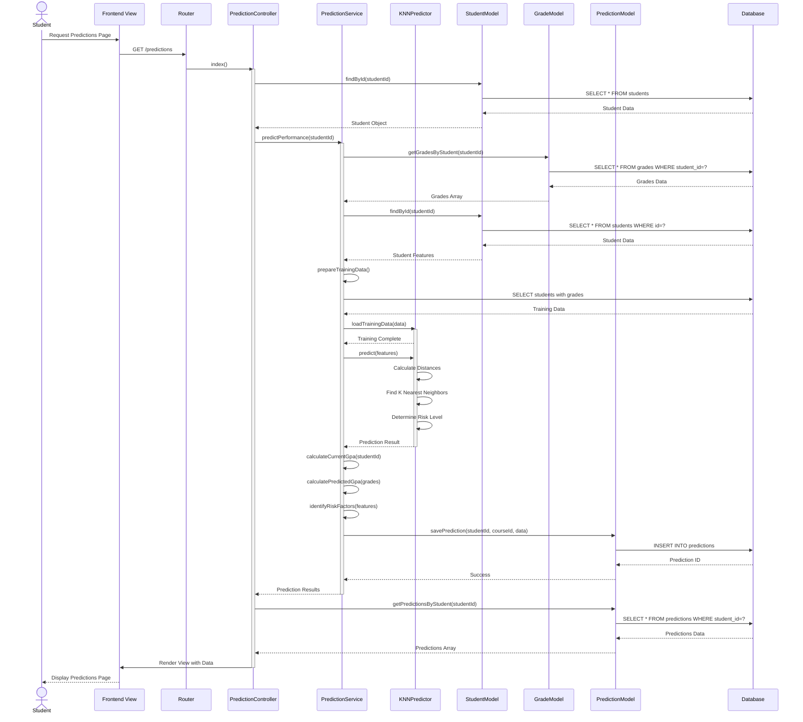
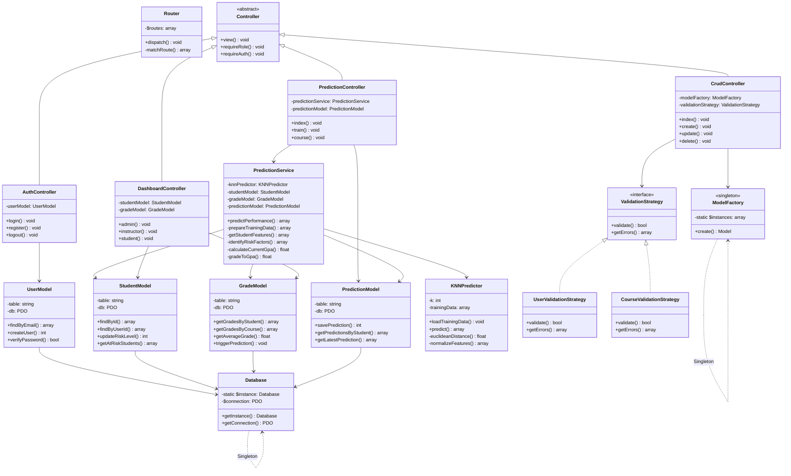
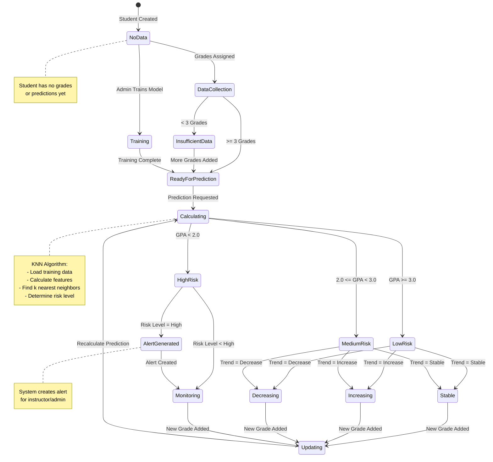

# EduPredict System Design Diagrams

## System Overview
EduPredict is an academic performance prediction system using KNN machine learning to predict student GPA and identify at-risk students. The system follows MVC architecture with role-based access control (Admin, Instructor, Student).

---

## 1. Context Diagram (Level 0 DFD)

---

## 2. Use Case Diagram

```mermaid
graph TB
    subgraph "EduPredict System"
        UC1[Login]
        UC2[Register]
        UC3[Logout]
        UC4[View Dashboard]
        UC5[Manage Users]
        UC6[Manage Courses]
        UC7[Manage Students]
        UC8[Assign Grades]
        UC9[View Grades]
        UC10[Generate Predictions]
        UC11[Train KNN Model]
        UC12[View Predictions]
        UC13[View Risk Alerts]
        UC14[Manage Alerts]
        UC15[View Reports]
        UC16[Manage Menu]
    end
    
    Admin[Administrator]
    Instructor[Instructor]
    Student[Student]
    
    Admin --> UC1
    Admin --> UC2
    Admin --> UC3
    Admin --> UC4
    Admin --> UC5
    Admin --> UC6
    Admin --> UC7
    Admin --> UC11
    Admin --> UC15
    Admin --> UC16
    
    Instructor --> UC1
    Instructor --> UC2
    Instructor --> UC3
    Instructor --> UC4
    Instructor --> UC6
    Instructor --> UC8
    Instructor --> UC9
    Instructor --> UC10
    Instructor --> UC12
    Instructor --> UC13
    Instructor --> UC14
    
    Student --> UC1
    Student --> UC2
    Student --> UC3
    Student --> UC4
    Student --> UC9
    Student --> UC12
    
    style Admin fill:#dc3545,stroke:#c82333,color:#fff
    style Instructor fill:#ffc107,stroke:#ff9800,color:#000
    style Student fill:#28a745,stroke:#20c997,color:#fff
```

---

## 3. Sequence Diagram - Generate Student Prediction (Critical Use Case)

---

## 4. Class Diagram

---

## 5. State Diagram - Student Prediction Lifecycle

---

## Diagram Notes

### Context Diagram
- Shows external entities (Admin, Instructor, Student) interacting with the EduPredict system
- Database is shown as a data store
- System acts as central process handling all interactions

### Use Case Diagram
- Groups use cases within system boundary
- Shows role-based access (different actors have different permissions)
- Critical use cases: Prediction generation, KNN training, Grade management

### Sequence Diagram
- Most critical use case: Generate Student Prediction
- Shows complete flow from user request to database operations
- Includes ML prediction process using KNN algorithm
- Demonstrates MVC pattern interactions

### Class Diagram
- Shows OOP structure with inheritance (Controller hierarchy)
- Demonstrates design patterns:
  - Singleton: Database, ModelFactory
  - Strategy: ValidationStrategy implementations
  - Factory: ModelFactory
- Shows relationships: composition, association, inheritance

### State Diagram
- Student Prediction lifecycle from creation to monitoring
- States represent prediction status and risk levels
- Transitions triggered by events (grade assignment, prediction request)
- Includes alert generation for high-risk students

---

## Technical Architecture Summary

**Patterns Used:**
- MVC (Model-View-Controller)
- Singleton (Database connection)
- Factory (Model creation)
- Strategy (Validation rules)

**Key Technologies:**
- PHP 8.2+ (Backend)
- MySQL 8.0+ (Database)
- KNN Algorithm (Machine Learning)
- PDO (Database Access)

**Security:**
- Role-based access control
- Password hashing
- Session management
- Input validation (client & server-side)

